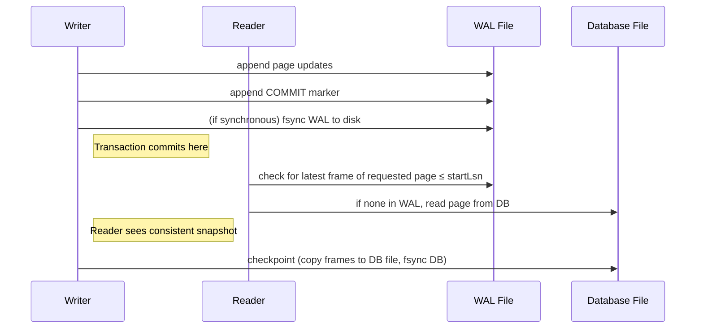
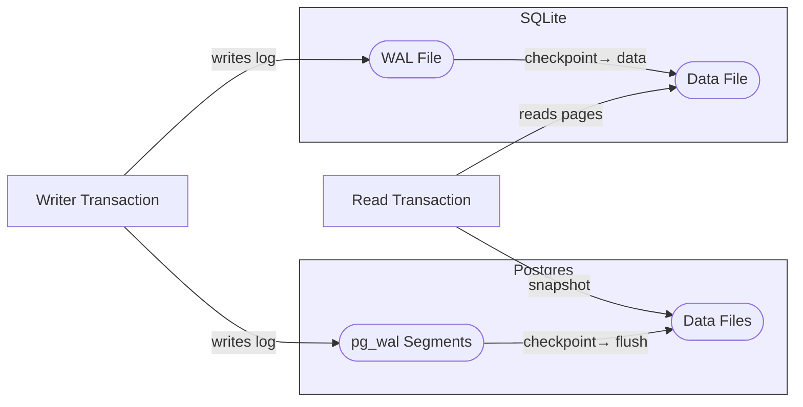

# Write-Ahead Logging (WAL) in Databases: Overview and Implementation in SQLite & PostgreSQL

## Executive Summary  
A *write-ahead log (WAL)* is an append-only journal where all intended database changes are first recorded before being applied to the data files【35†L137-L140】【16†L36-L44】. This ensures **durability** (committed changes survive crashes) and **atomicity** (partial transactions can be undone or completed) without forcing every changed page to disk on commit【16†L57-L64】【35†L137-L140】. WAL is generally superior to alternatives like **shadow paging** – which copies pages to new locations and swaps a pointer – because WAL supports concurrent access and more efficient writes【30†L150-L161】【21†L49-L52】.  In WAL, checkpoints periodically transfer logged changes into the main database, allowing recovery to replay missing updates from the log after a crash【16†L36-L44】【17†L41-L50】. SQLite and PostgreSQL both use WAL with different architectures: SQLite appends *page frames* to a single WAL file and allows many readers with one writer【9†L167-L175】【45†L1503-L1512】, while PostgreSQL writes a stream of WAL records into fixed-size segment files (typically 16 MB) with MVCC enabling full read/write concurrency【47†L47-L55】【52†L40-L49】. These implementations differ in on-disk formats, checkpoint policies, WAL rotation, durability guarantees (sync semantics), and configuration. This report defines WAL, explains its role in ACID and recovery, contrasts it with shadow paging and other logging schemes, and then examines SQLite’s and PostgreSQL’s WAL implementations in detail (architecture, formats, checkpoints, concurrency, rotation, fsync semantics, recovery, and tuning parameters), citing official documentation and research. A comparison table summarizes key attributes.

## WAL: Definition and Purpose  
A *write-ahead log* is an append-only disk log that records every change to the database before it is applied to the data pages【35†L137-L140】【16†L36-L44】.  By flushing the log to stable storage first, a system can commit a transaction without immediately writing all modified data pages, since any un-flushed changes can later be replayed (redo) from the log【16†L36-L44】【35†L137-L140】. This provides **durability**: once a transaction’s changes are logged and the log is synced, the transaction’s effects survive crashes【16†L57-L64】【35†L137-L140】.  WAL also supports **atomicity**: if a crash occurs, uncommitted transactions are simply undone by ignoring their log entries, while committed changes are applied during recovery【35†L157-L164】【52†L61-L70】. In practice, WAL often stores both *undo* and *redo* information for each update, allowing efficient rollback of aborted transactions and replay of committed updates【35†L157-L164】【38†L589-L597】. WAL thereby underlies modern crash recovery: on restart the system finds the last checkpoint and replays (redo) logged changes up to the crash point, then discards any incomplete transactions.  

Because WAL writes are sequential, they are much faster than random updates to data pages, especially on spinning disks or SSDs【16†L57-L64】【8†L73-L80】. As the PostgreSQL docs note, a single fsync of the WAL can commit many small transactions, vastly reducing I/O overhead【16†L57-L64】.  Furthermore, journaling file systems become unnecessary when WAL is used, since the database itself can restore consistency【16†L47-L55】. In summary, WAL’s core idea is **“log first, apply later”**: append all change records to the log and sync it, then later apply changes to the database. This guarantees that *in the event of a crash, no committed change is lost*, and incomplete changes are not reflected in the data files.

## Alternatives to Write-Ahead Logging  
Databases historically used other techniques for atomic updates:

- **Shadow Paging (Copy-On-Write)**: Maintain two page tables – a *shadow* (stable) and *current* (working) copy【21†L13-L22】. On commit, write all modified pages to new locations and atomically swap the pointer from the shadow to the current page table【21†L31-L39】.  Recovery is trivial (just use the shadow table) and no log is needed, but it requires copying the entire page table on each commit, making commits very expensive for large databases【21†L49-L52】【30†L150-L161】.  Shadow paging also handles only serial (single-threaded) transactions well; concurrent access is hard. Because of these costs, shadow paging is rarely used in high-performance systems and is generally considered inferior to WAL【30†L150-L161】【21†L49-L52】.

- **Undo/Redo Logging (Immediate vs Deferred Update)**:  Traditional recovery schemes are classified by whether they write changes to data pages immediately (steal) or delay them until commit (no-steal). For example, an *undo log* (immediate update) records old values so that incomplete transactions can be rolled back【38†L589-L597】. A *redo log* (deferred update) records new values after commit so that pages need not be written at commit time. WAL systems like ARIES combine both undo and redo: pages are updated in-place (steal/no-force), so undo logs allow aborting, and redo logs allow skipping page writes on commit【30†L161-L170】. ARIES and similar algorithms use WAL plus advanced techniques (physiological logging, log sequence numbers on pages, "repeating history" replay) to support high concurrency and fine-grained recovery【4†L14-L24】【30†L161-L170】.  (In effect, ARIES is a particular WAL-based method with optimizations, not a fundamentally different category.)

- **Group Commit (Write Batching)**: This is an optimization for WAL rather than a distinct recovery scheme. With group commit, multiple transactions delay their commit slightly to allow one disk flush (fsync) to cover them all. For example, PostgreSQL’s `commit_delay` and `commit_siblings` parameters introduce a brief wait so that nearby transactions can join a single WAL flush【15†L117-L126】【52†L108-L116】.  Group commit reduces I/O latency when many small transactions commit concurrently; it does not change WAL semantics, only amortizes fsync cost.  

Table: Comparison of logging methods  

| Feature            | Write-Ahead Log (WAL)                   | Shadow Paging                          | ARIES (WAL-based)                       | Group Commit (batch flush)            |
|--------------------|-----------------------------------------|----------------------------------------|-----------------------------------------|---------------------------------------|
| Update mode        | In-place updates with log records【30†L161-L170】 | Copy-to-new location, pointer swap【21†L31-L39】  | In-place (physiological) with full logging【4†L14-L24】【30†L161-L170】 | N/A (applies to WAL fsync only)      |
| Logging            | Append redo/undo records before page writes【38†L589-L597】【35†L157-L164】 | None (atomic pointer swap at commit)【21†L31-L39】 | Append redo/undo for every change【4†L14-L24】【30†L175-L183】 | See WAL (usually WAL with sync grouping) |
| Commit protocol    | Write log, fsync (sync) WAL, then apply (checkpoint later)【16†L57-L64】【35†L157-L164】 | Flush pages and new page table, update root pointer (atomic)【21†L31-L39】【30†L150-L161】 | Write log records and (with full_page_writes) entire page on first change after checkpoint【47†L70-L77】 | Delay flush up to `commit_delay` for concurrency【52†L108-L116】 |
| Concurrency        | Many readers + one writer (MVCC can allow true read/write concurrency)【9†L167-L175】【16†L57-L64】 | Serial (locks prevent concurrent writes easily)【21†L49-L52】 | Fine-grained locks, readers non-blocking writers【4†L14-L24】 | Improves parallel commit rate, no effect on isolation |
| Recovery           | REDO any missing updates from log; UNDO partial ones【35†L157-L164】【4†L14-L24】 | No recovery needed beyond pointing to shadow (logically atomic)【21†L31-L39】 | REDO all, then UNDO losers (repeating history)【4†L14-L24】 | Same as WAL (recovery uses WAL)         |
| Performance        | Sequential log writes are fast; can batch fsync; metadata overhead modest【16†L57-L64】【8†L73-L80】 | May minimize log I/O (none) but must rewrite all changed data page pointers; random writes dominate【21†L49-L52】 | More logging overhead than simple WAL, but enables strong concurrency and small-scale recovery【30†L161-L170】【4†L14-L24】 | Reduces fsync count under heavy commit load【15†L117-L126】【52†L108-L116】 |

Sources: ARIES and recovery literature【4†L14-L24】【30†L161-L170】; database textbooks【21†L31-L39】【38†L589-L597】; PostgreSQL documentation on WAL【16†L57-L64】【47†L70-L77】.

## SQLite WAL Implementation  

### Architecture and Modes  
SQLite’s WAL mode (introduced in version 3.7.0) replaces the traditional rollback-journal with an append-only log file. When in WAL mode, SQLite maintains three files per database: the main **.db** file (the database), a `-wal` file (the WAL log), and a `-shm` shared-memory file (an index)【45†L1503-L1512】. The database file format itself is unchanged, ensuring compatibility, and the WAL file format is well-defined and cross-platform【12†L353-L359】【45†L1503-L1512】. To switch to WAL mode, one executes `PRAGMA journal_mode=WAL;`【8†L69-L77】. In WAL mode, all changes are appended to the WAL file as **frames**, each frame containing a full copy of one page’s new content【45†L1533-L1545】. A transaction commit is recorded by appending a special commit frame to the WAL; notably, the actual database file does not need to be updated at commit time【59†L129-L137】. Readers simply consult the database file and the WAL to see the latest state.

SQLite’s WAL offers several advantages【59†L73-L81】:
- **Concurrency**: Multiple readers can operate while a writer appends to the WAL. Readers read their own consistent snapshot by ignoring WAL frames beyond the point at which their transaction began【45†L1616-L1630】【59†L79-L83】. A writing connection obtains an exclusive write lock only on the WAL file, not on readers. Thus, readers never block the writer and vice versa【59†L73-L81】【9†L167-L175】.  
- **Performance**: WAL writes are sequential; each changed page is written only once to the WAL (instead of twice in rollback mode: once to journal and once to DB)【9†L207-L214】. In practice this yields large speedups: for example one study found WAL mode achieved ~10× faster write throughput than the default journal, especially under concurrent access【55†L129-L138】【59†L73-L81】. SQLite itself notes that WAL “is significantly faster in most scenarios”【8†L73-L80】.  
- **Reduced fsyncs**: WAL can defer data file syncs until checkpoint time, thus using far fewer expensive fsync operations. (Instead, only the WAL needs to be synced on commit.)【9†L207-L214】【59†L79-L81】. This also makes WAL mode less sensitive to a buggy fsync implementation.  

### WAL On-Disk Format  
The SQLite **WAL file** consists of a 32-byte header followed by a sequence of *frame* entries【45†L1503-L1512】. Each frame is 24 bytes of header + *page-size* bytes of page image【45†L1533-L1545】. The WAL header fields include a magic number, page size, checkpoint counter, salt values, and checksums【45†L1523-L1531】. Every frame header contains the database page number and a cumulative checksum (including header and all prior frames)【45†L1533-L1545】. This design lets SQLite identify valid frames and detect torn writes or resets. Importantly, the WAL can be “rewound”: after a full checkpoint (described below), the first free write will reset the header salts, invalidating old frames and allowing reuse of the WAL file start【45†L1513-L1521】【45†L1601-L1609】.  (Optionally the WAL can be truncated at reset, but usually it is not, for performance.)

The associated **`-shm` index file** stores metadata (recent read locks, frame indices) to accelerate lookups, but is not part of the durable log.

### Checkpointing and Reset  
A **checkpoint** is the process of copying valid frames from the WAL back into the database file. SQLite does this periodically (by default when the WAL exceeds 1000 pages) or can be triggered by `PRAGMA wal_checkpoint`. During a checkpoint, SQLite first flushes all WAL frames to disk (if not already), then copies each page image into the main database file, and finally fsyncs the database file【45†L1585-L1593】. The WAL header contains a “checkpoint sequence number” so that recovery knows up to which point in the WAL is already applied【45†L1519-L1527】.

Checkpoints can proceed incrementally. If readers are still using old snapshots, a checkpoint will stop at the last WAL frame needed by any active reader【45†L1585-L1593】【45†L1616-L1630】. Once all readers have moved past the checkpointed state, a “complete checkpoint” can run, after which new transactions can overwrite the WAL from the start. At that moment SQLite performs a **WAL reset**: it increments the header salt value and (often) resets the WAL pointer to zero【45†L1601-L1610】. This marks all old WAL frames invalid, preventing them from being applied again, and effectively reuses the WAL file as a circular log without growing indefinitely【45†L1601-L1610】. The optional PRAGMA `journal_size_limit` can force truncation of the WAL at reset; otherwise SQLite simply writes over the old content【12†L378-L387】【45†L1611-L1614】. In short, WAL rotation in SQLite is implicit: after a checkpoint and reset, the log reuses its space from the beginning【45†L1601-L1609】.

### Concurrency and Readers  
SQLite’s WAL mode allows multiple readers concurrently with one writer. A writer grabs a *WAL write lock* to append frames, but does not block existing readers. Each new read transaction records the current end of WAL (a frame count). When reading a page, a reader checks for any valid WAL frames for that page up to its starting point; if found, the latest such frame is used, otherwise it reads the page from the database file【45†L1616-L1624】. This ensures each reader sees a consistent snapshot: new writes after the reader’s start are ignored by that reader【45†L1624-L1630】. In practice, this means a reader never blocks a writer and vice versa (except when the last reader holds the write-lock for cleanup).  (However, WAL mode prohibits opening the same database over a network file system due to the need for shared memory, and older SQLite versions cannot open a WAL-mode file at all【59†L83-L91】.)

### Durability and fsync Semantics  
SQLite’s durability depends on the `PRAGMA synchronous` setting, as it did with rollback journaling. In **FULL** synchronous mode, SQLite will issue `fsync` on the WAL file on each commit before returning success to the client【9†L207-L214】. This guarantees that the log record is on stable storage at commit. In **NORMAL** mode (the default in WAL mode), SQLite does not immediately fsync on each commit; instead it relies on the subsequent checkpoint to fsync the database file【9†L207-L214】. (Either way, writes into the WAL file are sequential and need only one fsync to commit many transactions.) In practice, WAL mode greatly reduces fsync frequency compared to rollback journaling: only WAL writes are synced, not every changed data page.

If synchronous is OFF, SQLite behaves like disabling fsync: crashes may lose the last few transactions and could corrupt data. But in normal or full modes, WAL ensures consistency. (SQLite also uses a *rollback journal* if required operations fail, but that is beyond WAL scope.)

### Recovery (Crash Handling)  
On startup, if a WAL file exists, SQLite enters recovery mode: it will replay any committed transactions recorded in the WAL back into the database file【40†L516-L520】【45†L1585-L1593】. Concretely, the first new connection after a crash acquires an exclusive lock and replays WAL frames up to the last commit marker. After that, the WAL is effectively checkpointed and can be reset. The recovery is straightforward because all needed changes are in the log; incomplete transactions (those with no commit marker) are simply ignored. The official doc notes that if the database was in WAL mode when it crashed, only SQLite 3.7.0+ can recover it (older versions don’t recognize the format)【40†L524-L532】. Once recovery completes, the database is consistent as if each committed transaction had fully applied. 

### SQLite Configuration Knobs  
Key WAL-related pragmas and settings in SQLite include: 
- `journal_mode=WAL` enables WAL mode (versus DELETE/ROLLBACK journals). Once set, WAL stays in effect across connections【8†L69-L77】.
- `synchronous` (OFF/NORMAL/FULL) controls fsync behavior for WAL and DB files【9†L207-L214】.
- `wal_autocheckpoint=N` adjusts the threshold (in pages) for automatic checkpoints【59†L147-L155】.
- `wal_checkpoint` (command or pragma) can trigger manual or passive checkpoints.
- `journal_size_limit` can cap the WAL file size and force truncation on reset【12†L378-L387】.
- PRAGMA settings for page_size and cache_size still apply as usual. 
These knobs allow tuning the balance between performance and durability. For example, setting `synchronous=FULL` (or `PRAGMA journal_mode=WAL` + `synchronous = NORMAL` for speed) versus `OFF` depends on risk tolerance【9†L207-L214】.

## PostgreSQL WAL Implementation  

### Architecture and WAL Files  
PostgreSQL uses WAL by default for its entire cluster. All transactions write log entries to the WAL in `pg_wal/` (or `pg_xlog/` in older versions). The WAL is a stream of *WAL records* with monotonically increasing **Log Sequence Numbers (LSN)**, which represent byte offsets in the log【47†L40-L49】. Records are grouped into 8 KB pages (WAL blocks) and written sequentially into 16 MB segment files (numbered in a vast namespace like `000000010000000000000001`)【47†L47-L55】.  (The segment size is set at initdb; 16 MB is typical.) Each segment file thus contains many WAL pages, and segments are allocated in sequence without wraparound.

A WAL record typically contains either a redo description of a change (new page image or logical operation) or control information. The on-disk format for WAL pages and records is defined in the source (`access/xlogrecord.h`)【47†L49-L55】. PostgreSQL also supports “logical WAL” for replication, but at its core it records physical changes to data pages. Because of MVCC, each WAL record is usually a change to a single page or index.

It is recommended to place `pg_wal/` on a separate disk or volume for performance and durability【47†L57-L64】. PostgreSQL’s background **WAL writer** process periodically flushes pending WAL to disk to limit the “risk window” of asynchronous commits (see below). 

### Checkpointing and WAL Rotation  
Checkpoints in PostgreSQL flush all *dirty buffers* (modified pages) to disk, then write a special checkpoint record into the WAL【17†L41-L50】. The WAL protocol requires that WAL records of all changes preceding the checkpoint record are safely on disk, and that all dirty pages are also on disk at the checkpoint moment【17†L41-L50】. The checkpoint record includes the LSN from which recovery must redo. After a checkpoint, any earlier WAL segments (before the one containing that checkpoint record) are no longer needed for crash recovery and can be removed or recycled (though they may be archived if point-in-time recovery is enabled)【17†L41-L50】.

PostgreSQL’s **checkpointer** process automatically triggers checkpoints at intervals defined by time (`checkpoint_timeout`, default 5 minutes) or WAL volume (`max_wal_size`, default 1 GB)【17†L41-L50】【25†L59-L68】. During a checkpoint, the I/O of writing pages is spread over time (`checkpoint_completion_target`) to avoid I/O spikes【17†L93-L102】【25†L93-L102】. After pages are flushed, a WAL checkpoint record is written and flushed to disk. Because checkpoints write entire pages after each checkpoint (if `full_page_writes` is enabled, the first change to a page logs the whole page), frequent checkpoints increase WAL volume【17†L73-L80】【25†L69-L77】. 

**WAL file rotation**: Old WAL segments are removed or recycled based on configuration. The parameters `min_wal_size` and `max_wal_size` set a recycling policy【25†L126-L134】. As WAL is generated, once usage exceeds `max_wal_size`, older segments are removed until under limit. Normally, PostgreSQL recycles segments rather than removing them to avoid reallocation cost. If archiving is enabled, segments cannot be removed until archived. The `wal_keep_size` setting can force keeping recent segments for standby servers【25†L141-L150】. Notably, WAL LSNs never wrap around (they simply increase), so old segment names continue incrementing without reuse.

### Concurrency and MVCC  
PostgreSQL uses MVCC for concurrency: readers see a snapshot and do not block writers, and writers do not block readers. Each committed transaction’s changes are WAL-logged before commit. Because of MVCC, multiple backends (clients) can run concurrently; behind the scenes, each backend or WAL writer will append to the WAL as it performs updates. There is effectively one writer activity at a time for a particular WAL segment, but multiple processes can flush their commit records into a shared WAL buffer concurrently, coordinated by locks. After the WAL buffer is flushed (via `XLogFlush`), the transaction is committed and clients are notified. Other clients (WAL buffer writers) may join this flush to achieve group commit.

Hence, unlike SQLite, PostgreSQL supports full *simultaneous* readers and writers at the page level (though writers do require lightweight synchronization on buffers). The WAL itself is written by a single WAL-writer process or the committing backend. Readers simply access data files that reflect pages as of their snapshot; recently committed changes reside in the WAL until eventually checkpointed to data files, but readers do not need to consult the WAL during normal operation (only during crash recovery) because MVCC updates data pages in-place when visible.

### Durability and fsync Semantics  
PostgreSQL provides several settings to control flush behavior:

- **fsync** (`postgresql.conf`): If enabled (the default), PostgreSQL forces each WAL flush via `fsync` (or equivalent) so that WAL records are truly on disk at commit time【15†L46-L54】. Disabling `fsync` lets the OS buffer WAL writes, greatly improving performance but risking loss of recent commits or corruption on OS crash【15†L46-L54】.
- **synchronous_commit**: By default, commits wait for the WAL flush (`fsync`). If `synchronous_commit` is set to `off`, the server reports commit success before WAL is flushed to disk【52†L40-L49】. This trades durability for latency: recent transactions may be lost on a crash, but the database will remain consistent (no partial transactions)【52†L61-L70】. PostgreSQL allows each transaction to request asynchronous commit, making durability a tunable parameter.
- **wal_sync_method**: Choice of sync mechanism (e.g. `fdatasync`, `open_datasync`) can be set for the WAL writes【15†L73-L82】.  
- **full_page_writes**: Enabled by default, it causes the entire page image to be logged on the first change after a checkpoint, ensuring torn-page safety【15†L95-L103】【47†L74-L77】.
- **commit_delay/commit_siblings**: These implement group commit. When commits occur concurrently, the backend will delay up to `commit_delay` microseconds if at least `commit_siblings` other transactions are committing, so that one flush can cover all【15†L117-L126】. This amortizes the cost of `fsync`. (Even without explicit delay, multiple commiters queue behind a WAL flush, allowing implicit grouping.)

In practice, a commit under default settings (`fsync` on, `synchronous_commit` on) is fully durable on return. If using asynchronous commit or turning off `fsync`, only durability is relaxed. Crucially, turning `fsync` off can lead to *database corruption*, whereas asynchronous commit only risks losing the last transactions【52†L98-L104】.

### Crash Recovery  
After a crash, PostgreSQL automatically performs WAL replay. The recovery process reads the last checkpoint location from the control file (`pg_control`), then scans the WAL from that point forward, redoing each change in order【47†L70-L77】. Because `full_page_writes` logged whole pages at first modification after checkpoint, the redo operation simply restores pages to a consistent state. Transactions that committed are redone; those that had not committed will be ignored (their changes never saw a WAL commit record). The server writes the new recovery state and exits in a consistent state.

If `pg_control` is missing or corrupt, the system could theoretically search WAL for the last checkpoint record, but in practice `pg_control` is small and kept safely on disk. After recovery, the database is ready to accept connections; WAL segments used before the checkpoint can be archived or deleted. For replication, similar recovery occurs on standbys, with WAL applied continually.

### Configuration Knobs  
Important WAL-related settings in PostgreSQL include:  
- **`checkpoint_timeout`**, **`max_wal_size`**: control how often automatic checkpoints run【17†L59-L68】【25†L59-L68】.  
- **`synchronous_commit`**: on/remote/off (controls durability of commit)【52†L40-L49】.  
- **`wal_level`**, **`archive_mode`**, **`archive_command`**: control how WAL is archived for backups (beyond crash recovery).  
- **`fsync`** and **`wal_sync_method`**: ensure WAL writes reach disk【15†L46-L54】【15†L73-L82】.  
- **`full_page_writes`**: on/off (torn-page protection)【15†L95-L103】.  
- **`checkpoint_completion_target`**: fraction of interval to spread I/O【17†L93-L102】.  
- **`commit_delay`** and **`commit_siblings`**: group-commit tuning【15†L117-L126】【52†L108-L116】.  

Admins balance these for performance vs durability. For example, increasing `max_wal_size` reduces checkpoint frequency (speeding up normal operations) but lengthens recovery time【17†L69-L77】. Disabling `fsync` or `synchronous_commit` speeds writes at risk of data loss, whereas enabling them ensures crash safety.

## Comparison: SQLite WAL vs PostgreSQL WAL  

| Aspect                | SQLite WAL                                 | PostgreSQL WAL                            |
|-----------------------|--------------------------------------------|-------------------------------------------|
| **Log files**         | Single `dbname-wal` file (plus index/shm)【45†L1503-L1512】 | Multiple 16 MB segment files in `pg_wal`【47†L47-L55】 |
| **Log format**        | Frames of complete page images with header/checksum【45†L1533-L1545】 | WAL pages (8 KB) with record headers (multi-page records allowed)【47†L49-L55】 |
| **Commit protocol**   | Append frames + commit marker to WAL; (optionally) fsync WAL (depending on `synchronous`)【59†L129-L137】【9†L207-L214】 | Append WAL record(s) and fsync (by default) WAL; can delay or async via settings【52†L40-L49】 |
| **Checkpointing**     | Automatic (e.g. every 1000 pages) or manual; copies WAL pages into DB file and fsyncs DB【45†L1585-L1593】 | Automatic (time/size-based) or manual; flushes all dirty buffers and writes checkpoint record to WAL【17†L41-L50】 |
| **Concurrency**       | Many readers + single writer. Readers see snapshot by checking WAL up to a frame count【45†L1616-L1630】. Writers wait for readers at checkpoints【9†L185-L193】. | Full MVCC: concurrent reads/writes. Writers do not block reads. Group commit allows multiple writers per fsync【15†L117-L126】. |
| **File rotation**     | WAL reset: after full checkpoint and no active readers, header salts change and new transactions overwrite WAL from start【45†L1601-L1610】. (Old content invalidated.) | Segments retire when old: if archived, keep them; otherwise recycle or delete beyond `max_wal_size`【25†L126-L134】. LSN space never wraps. |
| **Durability**        | Dependent on `synchronous`. FULL syncs WAL on commit; NORMAL syncs on checkpoint【9†L207-L214】. Crash recovery replays WAL frames【45†L1585-L1593】. | Dependent on settings: by default sync WAL on commit (`fsync`, `synchronous_commit`). Asynchronous commit mode may delay WAL flush up to `wal_writer_delay`【52†L85-L93】. Recovery replays WAL from last checkpoint【47†L70-L77】. |
| **Configuration**     | `PRAGMA journal_mode=WAL`, `synchronous`, `wal_autocheckpoint`, `journal_size_limit`【8†L69-L77】【9†L207-L214】. | `synchronous_commit`, `fsync`, `wal_sync_method`, `commit_delay`, plus checkpoint parameters (`checkpoint_timeout`, `max_wal_size`, etc.)【15†L46-L54】【17†L59-L68】. |
| **Recovery Time**     | Proportional to WAL size since last checkpoint. (Small DB = fast.) | Proportional to WAL since last checkpoint; shorter with frequent checkpoints. `max_wal_size` trades run-time vs recovery-time【17†L69-L77】. |
| **Uses**             | Suitable for embedded/single-node use. No network files. Mainly for durability/local concurrency. | Designed for multi-user servers. Enables replication (WAL shipping) and recovery of large DB clusters. |

(See sources above for specifics.) Both systems’ WAL ensure that committed transactions are durable and that crash recovery is reliable, but they differ in scale and tuning.

## Diagrams 

*Sequence diagram:* A writer appends page images and a commit marker into the WAL (and fsyncs it under strong durability modes).  Readers access pages by consulting the database file and recent WAL frames up to their start-of-transaction LSN, providing a consistent snapshot【45†L1616-L1624】. Checkpoints later transfer WAL frames into the DB file.  

*File-flow diagram:* SQLite uses one WAL file where all changes accumulate and checkpoints feed back into its DB file. PostgreSQL uses many WAL segment files (`pg_wal`) feeding changes into its shared data files. Readers in each system fetch pages from the data files (using snapshots in PostgreSQL/MVCC, or by also checking the WAL in SQLite)【45†L1616-L1630】【47†L70-L77】.

## Key References  
Key sources include the official SQLite documentation (Section *“Write-Ahead Logging”*) for WAL format and behavior【45†L1503-L1512】【45†L1585-L1593】, the PostgreSQL documentation (Chapter *Reliability and WAL*) for WAL configuration and internals【16†L36-L44】【17†L41-L50】, and foundational papers. The ARIES paper (Mohan et al.) describes WAL-based recovery with fine-grained logging【4†L14-L24】. The *Segment-Based Recovery* paper reviews WAL versus shadow paging and details the steal/no-force scheme【30†L161-L170】.  We also cite database textbooks and slides for concepts like shadow paging and the WAL rule【21†L31-L39】【38†L589-L597】. These sources confirm the definitions and guarantees of WAL and its implementation details in SQLite and PostgreSQL.

**Example follow-up question:** *“How do different hardware (SSD vs HDD) or file systems affect WAL performance and durability?”*